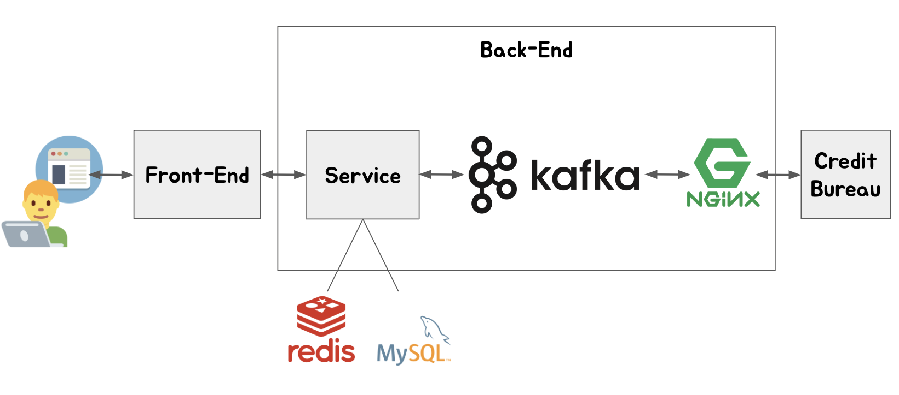
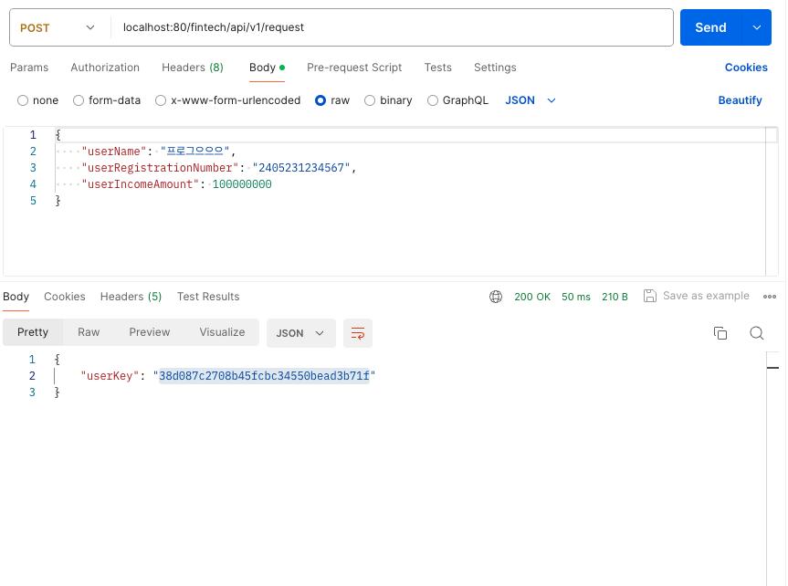
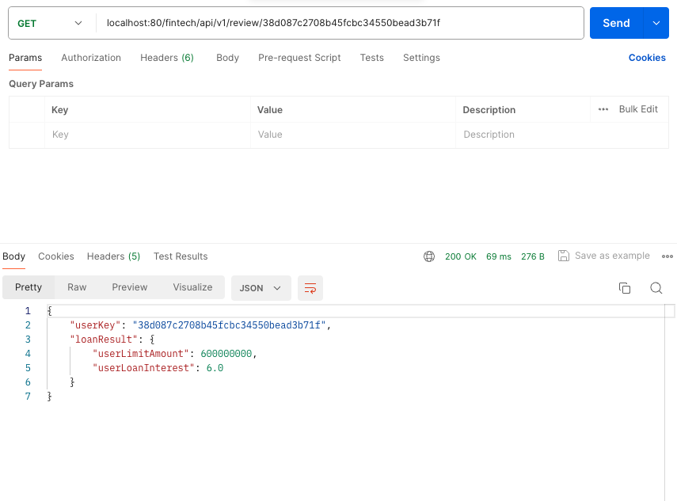

# 개요
이 프로젝트는 대출 심사 프로세스를 간소화한 버전으로  
두 개의 테이블과 두 개의 API로 구성되어있습니다.

# 기술 스택
- 언어
    - 코틀린
- 프레임워크 및 라이브러리
    - Spring Boot(Multi Module)
    - JPA(Spring Data JPA)
    - Kafka
    - Nginx
    - JUnit5
    - Swagger
- Infra
    - MySQL
    - Redis
    - Docker

# 전체 구조

# 테이블
## USR_INFO
| 컬럼명         | 타입          | 설명                  |
|:------------|:------------|:--------------------|
| id          | BIGINT      | PK                  |
| usr_key     | VARCHAR(32) | UUID로 직접 생성한 유저 key |
| usr_reg_num | VARCHAR(50) | 암호화된 주민번호           |
| usr_nm      | VARCHAR(20) | 유저 이름               |
| usr_icm_amt | BIGINT      | 유저 소득 금액            |

## LOAN_REVIEW
| 컬럼명          | 타입          | 설명     |
|:-------------|:------------|:-------|
| id           | BIGINT      | PK     |
| usr_key      | VARCHAR(32) | UUID로 직접 생성한 유저 key |
| loan_lmt_amt | BIGINT      | 대출 한도 금액 |
| loan_intrt   | DOUBLE      | 대출 이자율 |

# API
- 대출 심사 요청 API /fintech/api/v1/request
- 대출 결과 요청 API /fintech/api/v1/review/{userKey}

# 결과



# 기타
## Docker 관련
- fintech-mysql.sh 실행
- fintech-redis.sh 실행
- docker compose up -d 실행

```bash
cd nginx
docker build -t fintech-nginx:1.0.0 .
docker run -d -p 8085:8085 --name fintech-nginx fintech-nginx:1.0.0
```

## Kafka 관련
### 토픽 생성
```bash
kafka-topics.sh --create --bootstrap-server localhost:9092 --replication-factor 1 --partitions 1 --topic loan-request
```

### 토픽 조회
```bash
kafka-topics.sh --list --bootstrap-server localhost:9092
```